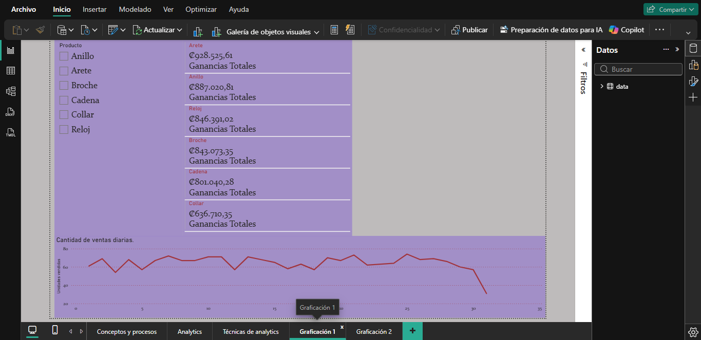
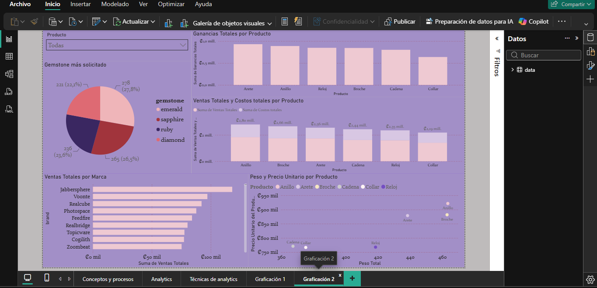

# Análisis de Ventas de una Joyería

## Descripción del proyecto

Este proyecto consiste en el desarrollo de un dashboard interactivo en Power BI para analizar el desempeño de las ventas de una empresa de joyería.

A través de diferentes visualizaciones y métricas se identifican tendencias de ventas, productos con mayor desempeño y otros indicadores relevantes para apoyar la toma de decisiones.

---

## Objetivo

Desarrollar un tablero interactivo que permita transformar los datos de ventas en información útil para facilitar el análisis del negocio y apoyar la toma de decisiones.

---

## Herramientas utilizadas

- Power BI
- Power Query
- DAX
- Microsoft Excel

---

## Habilidades demostradas

- Limpieza y transformación de datos
- Modelado de datos
- Creación de medidas con DAX
- Diseño de dashboards
- Visualización de datos
- Análisis de indicadores (KPIs)

---

## Archivos del proyecto

- jewelry-sales-analysis.pbix
- Joyería.xlsx

---

## Dashboard

### Página 1

### Página 2

